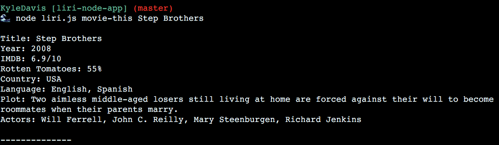

# liri-node-app

## Purpose
This node application is a basic CLI program that demonstrates the capabilites of Node packages and API database retreival.

## Instructions
To use properly, use the 4 commands 'concert-this', 'spotify-this-song', 'movie-this', **or** 'do-what-it-says' followed by any song, movie, or music artist you can think of!

***Side note:***
The 'do-what-it-says' command is a simulated experience for what would be a voice command. Currently it only takes 3 different inputs:
- 'Drop Dem Bullets' (searches for **The Matrix** movie.)
- 'For Whom The Bell Tolls' (searches for **Metallica** concerts.)
- 'I Want It That Way' (searches for the **Backstreet Boys** song via Spotify.)

### Examples:

